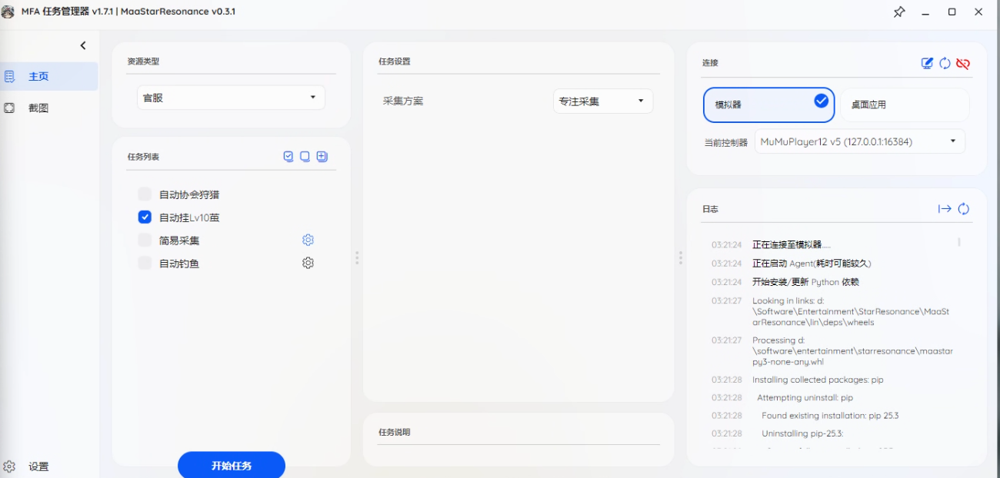
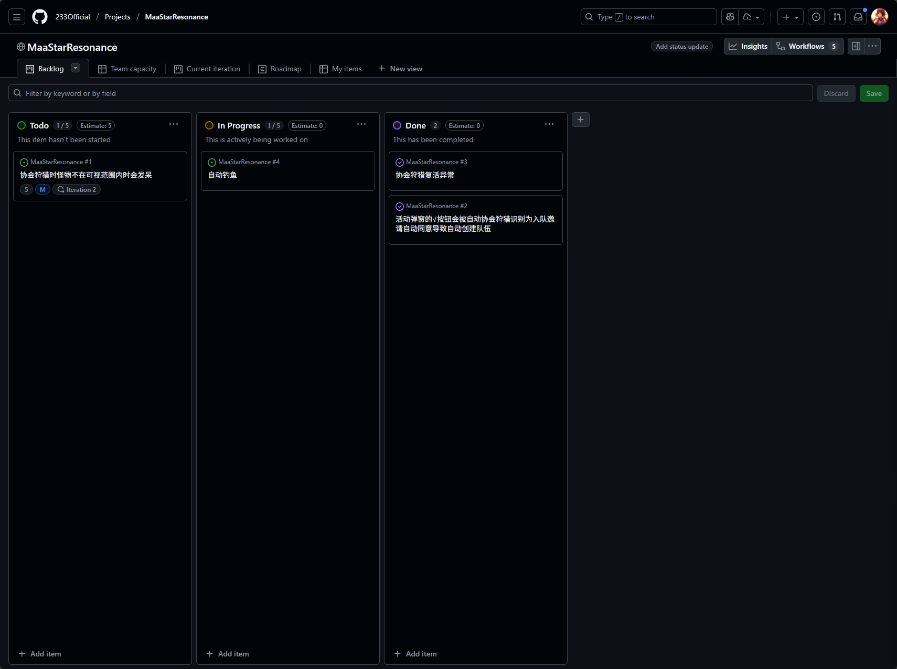

<!-- markdownlint-disable MD041 -->

# MaaStarResonance

基于图像识别的星痕共鸣自动化工具

由 [MaaFramework](https://github.com/MaaXYZ/MaaFramework) 强力驱动！  

<a href="https://github.com/233Official/MaaStarResonance" target="_blank" style="font-weight: bold;">🔗 本项目 GitHub 仓库</a> 

  
  
  
   
  
  
  

---

## 界面预览

---

## 功能列表与使用说明

- [新手上路](./docs/用户文档/新手上路/新手上路.md)(**使用前必看**)
- [自动协会狩猎](./docs/用户文档/任务流说明/自动协会狩猎/使用须知.md)
- [简易采集](./docs/用户文档/任务流说明/简易采集/简易采集使用须知.md)
- S2挂浮游之茧
  - [Lv10浮游之茧](./docs/用户文档/任务流说明/)
    - 早期版本, 可能不够稳定,欢迎反馈异常情况
    - 目前阶段所有茧掉落的都是 1 级因子, 其他茧暂时没有写的必要了, 挂完 10 级因子直接到 Lv18 挂野怪就行了
    - PS: 不进入茧只挂 Lv18 茧外围怪物的话赛季积分获取率太低(愈合 8h 挂了不到 5w 的水平), 奔着积分来的话还是挂 Lv10 的茧比较好
- 自动钓鱼
  界面上的自动钓鱼只是个壳子, 无法真实使用, 目前自动钓鱼功能实现优先级低, 建议使用
  - 模拟器手游版-Maa 钓鱼: <https://github.com/26F-Studio/maa-star-resonance>
  - WegamePC 版前台钓鱼: <https://github.com/Sanheiii/ok-star-resonance>

---

## 鸣谢

本项目由 **[MaaFramework](https://github.com/MaaXYZ/MaaFramework)** 强力驱动！  
UI 由 [MFAAvalonia](https://github.com/SweetSmellFox/MFAAvalonia)  大力支持！

感谢以下开发者对本项目作出的贡献:

---

## References

- 项目图标来源: [艾露娜Q版表情包全套高清修复分享｜星痕共鸣｜腾讯频道](https://pd.qq.com/g/pd34199182/post/B_e60f346878db0d001441152189808449200X60)

---

## TODO

当前 TODO 可以在 [项目Project](https://github.com/users/233Official/projects/1) 中查看:

---

一些立项初期写的 TODO:

- 全局

  - [ ] 风猪粉猪刷声望

  - [ ] 顺线刷首领拿装备箱子

  - [ ] 钓鱼

    > 暂时不打算做, 有 [Sanheiii/ok-star-resonance: 基于ok-script的星痕共鸣自动工具](https://github.com/Sanheiii/ok-star-resonance) 可以用

  - [ ] 怪物图鉴

    太多了, 优先级太低

- [ ] 协会狩猎

  - [x] 自动入队, 自动确认, 自动狩猎
  - [ ] 锁定与转视角

- 日常

  - [ ] 每天的两个精英钥匙和首领钥匙, 顺便可以把开拓者嘉奖的大世界野外分类做完

    - 不一定当前只有两个
    - 要选择要打什么

  - [ ] 生活职业每天的 400 体力, 顺便可以把开拓者嘉奖的生活职业分类做完

    - 不一定 400 体力
    - 要选择做什么

  - [ ] 神秘商店

    技能书, 礼遇卡, 美发券, 绑钻买玩具(待定, 不清楚会不会出问题)

  - [ ] 协会打卡 & 协会货运

    协会货运状况比较多

  - [ ] 神人小题目

    题库不全, 优先级不高

  - [ ] 每日活跃度奖励

  - [ ] 不稳定

    可以挂机又不完全可以挂机

  - [ ] 家园委托

    没啥收益, 优先级低

  - [ ] 开拓局委托

    不考虑自动化, 由于有小号, 会给小号做个自动确认自动攻击

- 周常

  - 噩梦三龙由于给星核所以每周都要手动打

  - 开拓者嘉奖要手动领取

    开拓者嘉奖任务 -> 分解到其他项目了, 这里不再展开

  - [ ] 赛季经验商店

    需要自定义换什么

  - [ ] 补偿商店

  - [ ] 缤纷商店

    - [ ] 蔷薇宝石商店

      需要选择买什么, 一般必买小蛋糕x10和扭蛋币x3

    - [ ] 友情点商店

      每周有 2000 上限, 这里必买的只有 300 绑玉了

    - 荣誉币商店没必要买, 直接下周买补偿商店

    - [ ] 声望商店

      就一个意志扭蛋币和20个卢诺大袋子要买, 不过也可能有人不想买卢诺袋子

  - [ ] 协会货运商店

    选择买专注药, 黄片, 精炼箱子, 紫片, 紫材料盒子, 蓝材料盒子(两个材料盒子一般不买)

  - [ ] ~~40 换 60, 60 换 80 重铸石~~

    新赛季没了

  - [ ] 司地门

    低层可以考虑实现全自动

  - [ ] 极限空间

    - [ ] 普通的 40 重铸石给大号已经五百多个了, 挂机也没必要挂这个

      但是友情点获取刷普本带人机最快, 刷 20 把拿 1000 友情点

      PS:

      - 看当前有多少友情点, 然后计算刷多少次

      除此以外还有刷时装也是普本刷

    - 困难的 60 重铸石大号已经快七百个了, 这个也没必要挂

    - [ ] ~~大师6 挂装备和 80 重铸石可以做, 顺便还能把开拓者嘉奖打了~~

      新赛季没了
  
  - [ ] 每日小活动拿友情点, 上限 1000, 每次 80, 要挂 13 次
  
    - [ ] 每天的路演小剧场, 舞蹈练习生直接挂机就行, 但是每周也就 5 + 4 次, 这样还差 4 次
    - 姆克营地巡逻还在, 但是现在玩家流失太严重, 1 线也不一定有人巡逻, 这个要做的话对寻路的要求比较高
    - 废都障碍赛, 换成载具赛, 气球捕获大作战, 小伊别盯我 这些不打算做自动化
  
---
