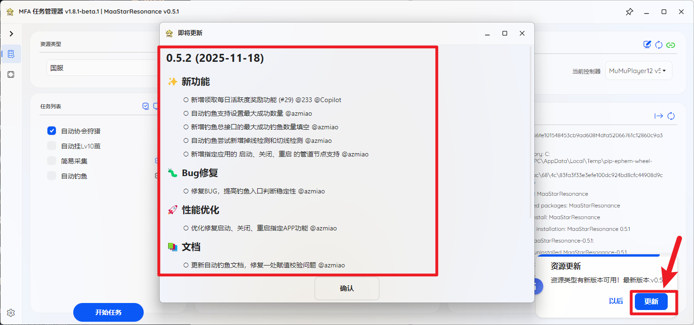
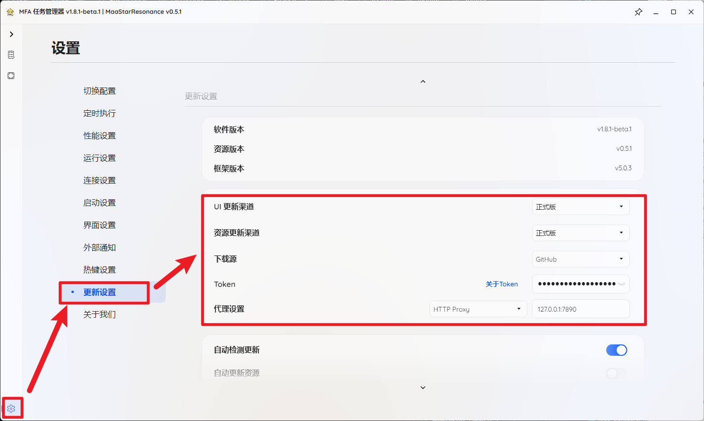
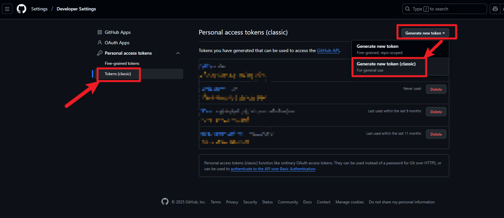
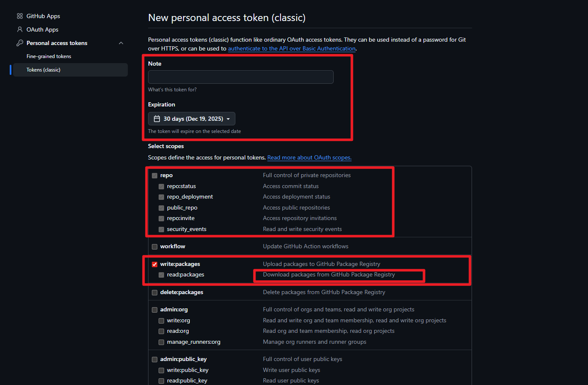
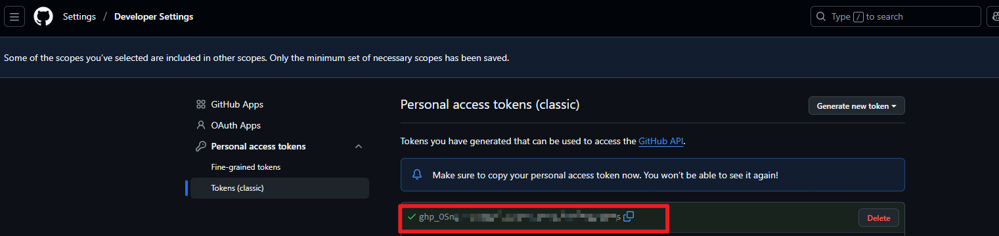
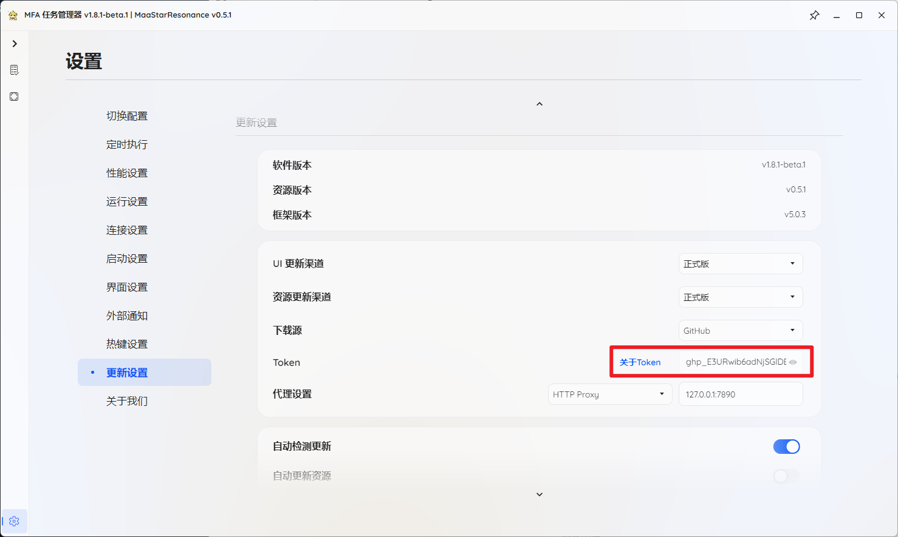
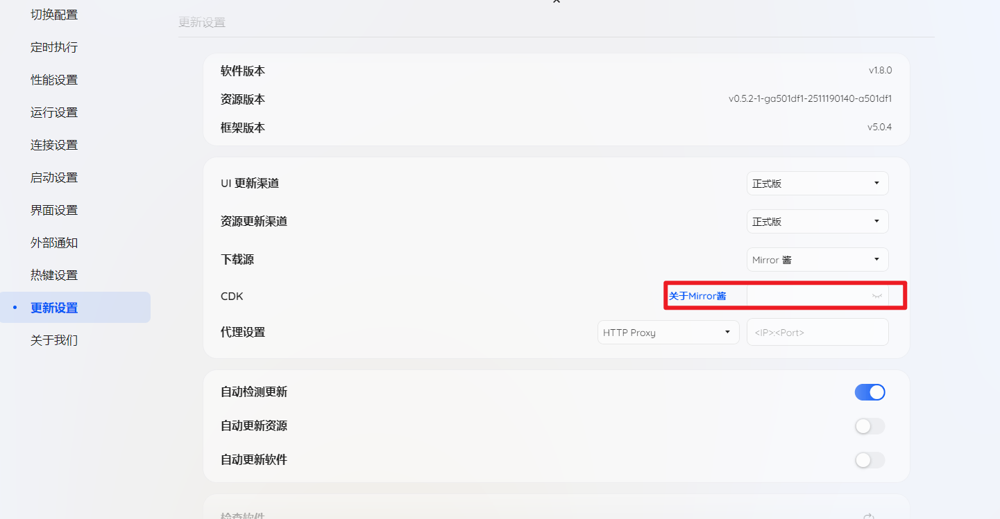
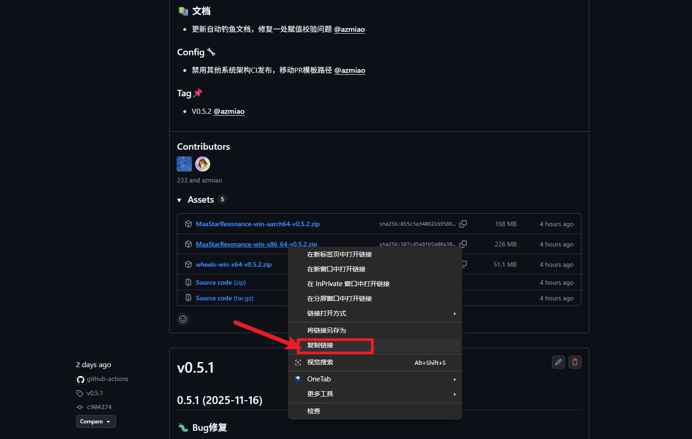
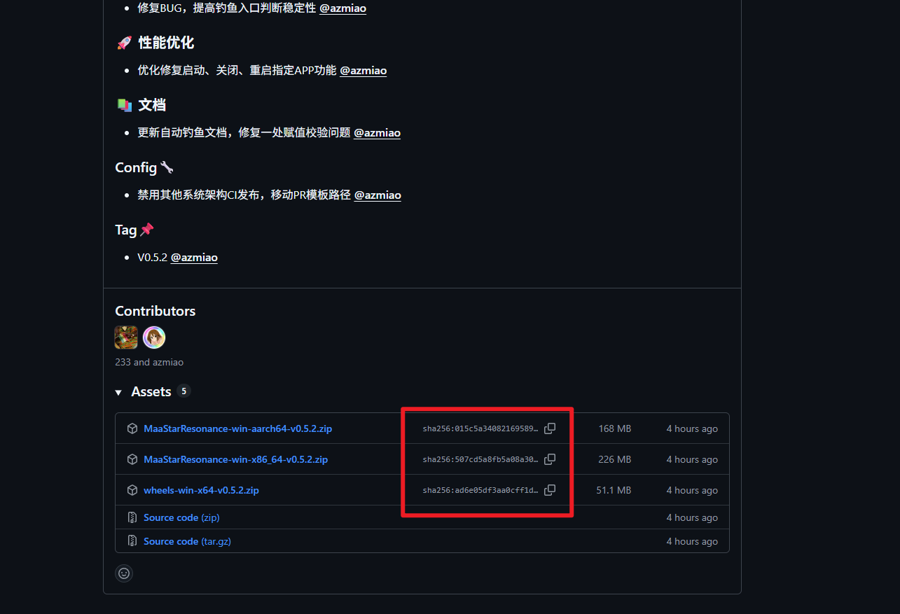

# 软件下载更新说明

当前软件更新大体分为两种方案

1. 通过 UI 界面提供的自动/手动选项更新软件
2. 直接下载软件压缩包覆盖安装

---

## 1.通过UI更新

当前软件每次启动运行完启动的默认任务后都会自动检测更新, 弹出版本更新日志以及更新按钮, 正常情况下可以直接点击 `更新` 按钮来进行更新, 详见下图:

---

具体的更新设置在此处可以进行配置:

---

这里的下载源分为 GitHub 与 Mirror 酱:

- GitHub: 项目仓库直接更新, 需要配置 token, 若无法直连 GitHub 或直连速度过慢需要配置代理

- Mirror 酱: 通过 Mirror 酱进行更新, 国内直连无需代理, 但需要购入 Mirror 酱 CDK

  > 当你使用其他 Mirror 酱支持的项目时购买了 Mirror 酱的 CDK, 那么此处亦可直接使用
  >
  > 如果你所在地区可以直连 GitHub 或者可以妥善处理网络环境, 那么建议使用 GitHub 源进行更新

---

### 1.1.通过 GitHub 更新

通过 GitHub 更新需要配置两个配置项

- `Token`: 用于保证下载稳定性

  当前 UI 通过 GitHub API 下载软件压缩包, 如果没有 Token 则会在短暂的快速下载后被 GitHub 限制, 可能导致更新失败

- `代理设置`: 支持 HTTP Proxy 与 SOCKS5 Proxy, 通过你配置的 Proxy 下载 GitHub 上的软件压缩包

  如果你不知道这是什么那么请忽略此项配置

---

这里展开讲讲如何获取 Token:

首先你需要有一个 GitHub 账户, 如下图所示打开 `Settings` 页面:

在左侧侧边栏找到 `Developer settings` 页面:

展开 `Personal access tokens` 选择 `Token(classic)`, 右上角选择 `Generate new token -> Generate new token(classic)`:

依次填写 `Note(key标识)`, 选择过期时间, 勾选下图中的权限复选框

最后点击 `Generate token` 创建 Classic token

然后复制这串 ghp 开头的 token 填写到 UI 对应配置输入框中即可:

---

### 1.2.通过 Mirror 酱更新

在下图所示输入框中填入 Mirror 酱 CDK 即可, 若当前没有 Mirror 酱 CDK, 可以

1. 选择文档其他方式进行更新
2. 点击下图所示的 `关于Mirror酱` 获取 CDK 然后进行填入即可

---

## 2.下载压缩包覆盖式更新

当前软件打包是便携版打包, 除了 [新手上路](https://github.com/233Official/MaaStarResonance/blob/main/docs/%E7%94%A8%E6%88%B7%E6%96%87%E6%A1%A3/%E6%96%B0%E6%89%8B%E4%B8%8A%E8%B7%AF/%E6%96%B0%E6%89%8B%E4%B8%8A%E8%B7%AF.md) 中提到的全局环境检查外, 所有软件运行所需内容都在解压后的文件夹中, 因此, 相应的你可以选择下载最新的软件压缩包解压后将其中的内容覆盖掉当前软件所在目录中的内容即可完成更新

---

这里提供几个下载最新的软件压缩包的方案

1. [Releases · 233Official/MaaStarResonance](https://github.com/233Official/MaaStarResonance/releases): 这是软件的官方发布位置, 在此处选择最新版本对应平台的压缩包进行下载是最准确的

   需要自行处理网络问题, 使用代理或镜像之类的手段加速下载

2. 通过 GitHub 代理/镜像站点间接下载官方 Release

   这里以 gh-proxy 为例: [GitHub 文件加速代理 - 快速访问 GitHub 文件](https://gh-proxy.com/)

   > 或者也可以自行查找其他的 GitHub 镜像/代理 站点

   在 GitHub Release 中复制需要下载的压缩包的链接然后访问   [GitHub 文件加速代理 - 快速访问 GitHub 文件](https://gh-proxy.com/) 填入链接并转换, 可以得到一些加速链接, 使用这些链接下载亦可

   

   

3. 通过 Mirror 酱下载软件压缩包

   访问 [Mirror酱/MAAStarResonance](https://mirrorchyan.com/zh/projects?rid=MaaStarResonance) 输入 CDK 然后点击下载即可

   

4. 通过 QQ 群文件下载

   当前项目并未建立 QQ 群聊, 除非你确定项目开发者在群聊中发布了软件压缩包, 否则一般不会采取此种方式进行下载更新

   倘若你一定要下载其他人分享的压缩包的话, 那么请务必校验该压缩包的 sha256 是否与 [Releases · 233Official/MaaStarResonance](https://github.com/233Official/MaaStarResonance/releases) 页面相应压缩包的 sha256 一致, 倘若不一致, 请不要使用

   

---

