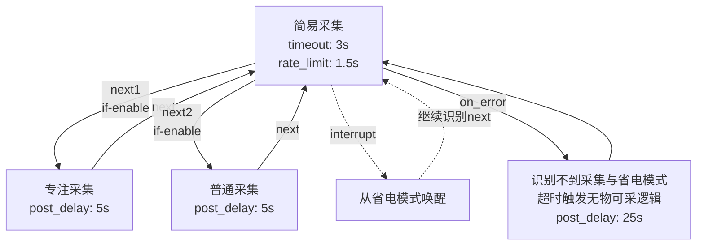

# 简易采集

流程图:

```mermaid
graph TB;
简易采集[简易采集<br>timeout: 3s<br>rate_limit: 1.5s]
专注采集[专注采集<br>post_delay: 5s]
普通采集[普通采集<br>post_delay: 5s]
从省电模式唤醒
无物可采[无物可采<br>inverse识别采集字样]

简易采集 -->|next1<br>if-enable| 专注采集 -->|next| 简易采集
简易采集 -->|next2<br>if-enable| 普通采集 -->|next| 简易采集
简易采集 -.->|interrupt| 从省电模式唤醒

简易采集 -->|on_error| 无物可采[识别不到采集与省电模式<br>超时触发无物可采逻辑<br>post_delay: 25s] -->简易采集

从省电模式唤醒 -.->|继续识别next| 简易采集
```

- 采集时长受生活职业技能加速节点加点以及设备性能影响在 `[2,5]s`

---
