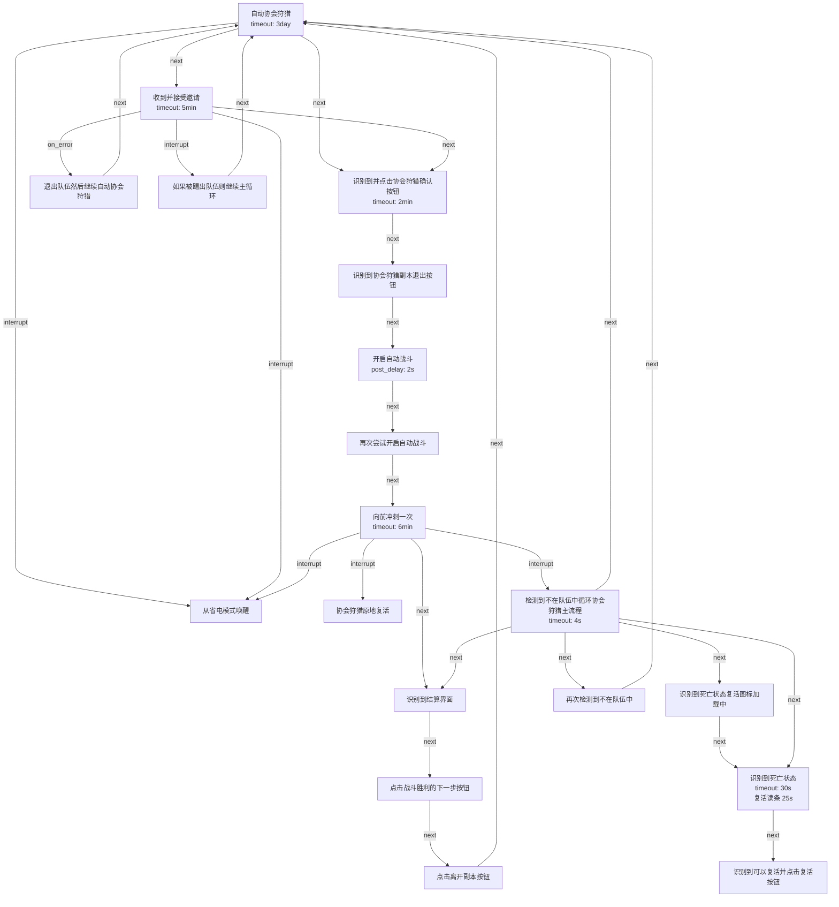
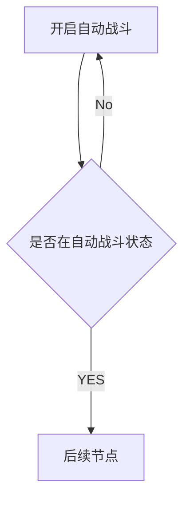
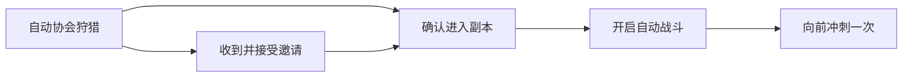
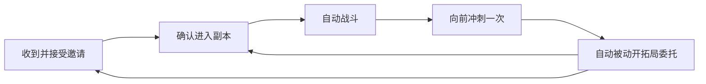

# 自动协会狩猎

流程图

```mermaid
graph TB;
自动协会狩猎[自动协会狩猎<br>timeout: 3day] --->|next| 收到并接受邀请[收到并接受邀请<br>timeout: 5min]
自动协会狩猎 --->|next| 识别到并点击协会狩猎确认按钮[识别到并点击协会狩猎确认按钮<br>timeout: 2min] ---> |next| 识别到协会狩猎副本退出按钮 --->|next| 开启自动战斗[开启自动战斗<br>post_delay: 2s] --->|next| 再次尝试开启自动战斗
自动协会狩猎 --->|interrupt| 从省电模式唤醒
收到并接受邀请 --->|next| 识别到并点击协会狩猎确认按钮
收到并接受邀请 --->|on_error| 退出队伍然后继续自动协会狩猎 --->|next| 自动协会狩猎
收到并接受邀请 --->|interrupt| 从省电模式唤醒
收到并接受邀请 --->|interrupt| 如果被踢出队伍则继续主循环 --->|next| 自动协会狩猎

再次尝试开启自动战斗 --->|next| 向前冲刺一次[向前冲刺一次<br>timeout: 6min] --->|next| 识别到结算界面 --->|next| 点击战斗胜利的下一步按钮 --->|next| 点击离开副本按钮 --->|next| 自动协会狩猎
向前冲刺一次 --->|interrupt| 从省电模式唤醒
向前冲刺一次 --->|interrupt| 协会狩猎原地复活
向前冲刺一次 --->|interrupt| 检测到不在队伍中循环协会狩猎主流程[检测到不在队伍中循环协会狩猎主流程<br>timeout: 4s] --->|next| 自动协会狩猎
检测到不在队伍中循环协会狩猎主流程 --->|next| 识别到死亡状态复活图标加载中 --->|next| 识别到死亡状态[识别到死亡状态<br>timeout: 30s<br>复活读条 25s] --->|next| 识别到可以复活并点击复活按钮
检测到不在队伍中循环协会狩猎主流程 --->|next| 识别到死亡状态
检测到不在队伍中循环协会狩猎主流程 --->|next| 识别到结算界面
检测到不在队伍中循环协会狩猎主流程 --->|next| 再次检测到不在队伍中 --->|next| 自动协会狩猎
```

```mermaid
graph TB;
enable_auto[开启自动战斗] ---> is_auto{是否在自动战斗状态} --->|YES| 后续节点
is_auto --->|No| enable_auto
```

```mermaid
graph LR;
accept_invite[收到并接受邀请] 
ensure_enter_instance[确认进入副本]

自动协会狩猎 ---> accept_invite
自动协会狩猎 ---> ensure_enter_instance

accept_invite --->  ensure_enter_instance

ensure_enter_instance ---> 开启自动战斗 ---> 向前冲刺一次
```

```mermaid
graph LR;
accept_invite[收到并接受邀请] 
ensure_enter_instance[确认进入副本]

自动被动开拓局委托 ---> accept_invite
自动被动开拓局委托 ---> ensure_enter_instance

accept_invite --->  ensure_enter_instance ---> 自动战斗 ---> 向前冲刺一次 ---> 自动被动开拓局委托
```
