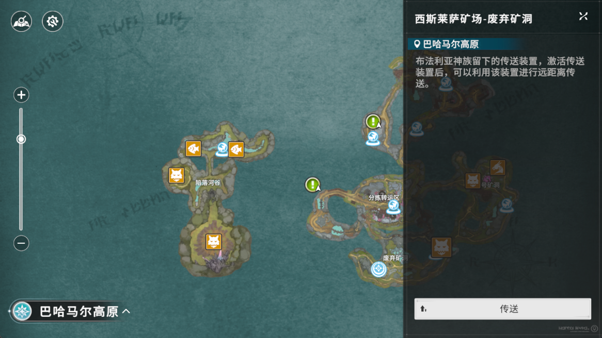
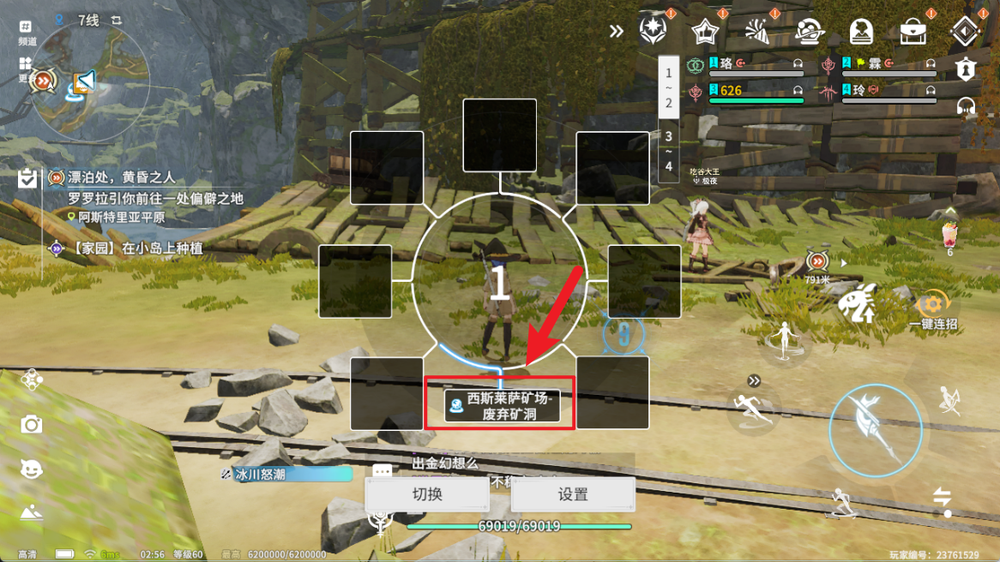
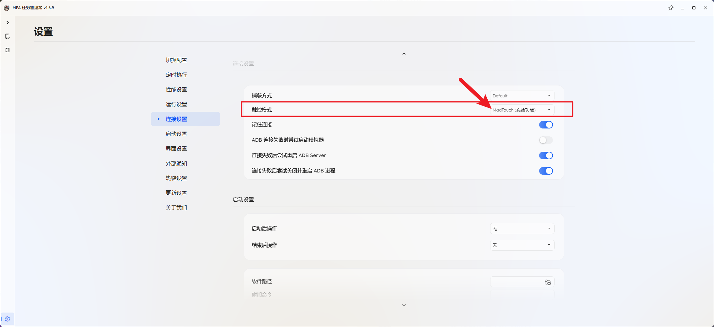

# S2 自动刷茧

## 10 级茧

前提条件: 绑定最近的传送点到指定键位, 使用快捷传送的方案简化设计

---

主体流程设计:

```Mermaid
graph LR
auto_cocoon_lv10[自动挂 10 级茧<timeout:1day>] --->|next| teleport[传送到最近的传送点] --->|next|寻路到茧 --->|next| auto_attack[启用自动战斗] --->|next|点击进入梦境 --->|next|等待疲劳值满 --->|next|等待疲劳值归零 --->|next| auto_cocoon_lv10
```

---

需要将如下传送点添加到快捷栏任意一页启用的正下方选项中：




---


---

写了个潦草的版本挂Lv10的浮游之茧,
可以传送到最近的这个传送点这里:


随便找一页快捷栏把这个传送点放在正下方这个位置:



记得手动把这个一键连招勾上, 不然UI上不显示


触控模式这里选择MaaTouch



勾选并开始任务即可:


---
