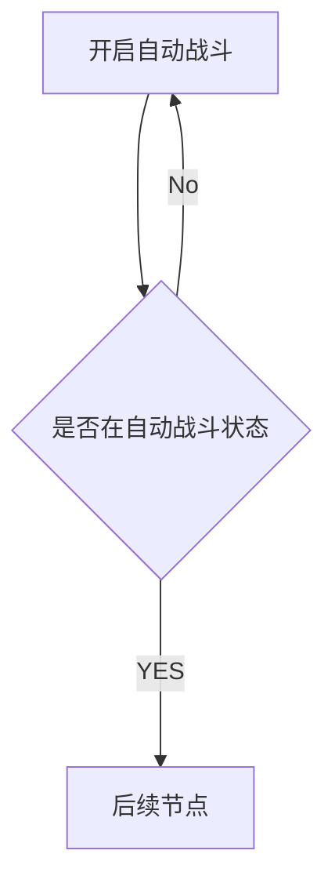
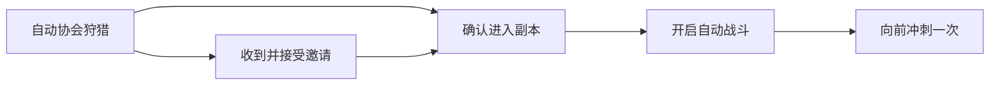
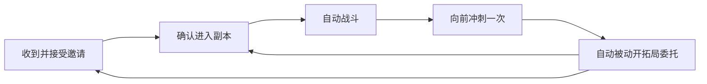

# 自动协会狩猎

```mermaid
graph TB;
enable_auto[开启自动战斗] ---> is_auto{是否在自动战斗状态} --->|YES| 后续节点
is_auto --->|No| enable_auto
```

```mermaid
graph LR;
accept_invite[收到并接受邀请] 
ensure_enter_instance[确认进入副本]

自动协会狩猎 ---> accept_invite
自动协会狩猎 ---> ensure_enter_instance

accept_invite --->  ensure_enter_instance

ensure_enter_instance ---> 开启自动战斗 ---> 向前冲刺一次
```

```mermaid
graph LR;
accept_invite[收到并接受邀请] 
ensure_enter_instance[确认进入副本]

自动被动开拓局委托 ---> accept_invite
自动被动开拓局委托 ---> ensure_enter_instance

accept_invite --->  ensure_enter_instance ---> 自动战斗 ---> 向前冲刺一次 ---> 自动被动开拓局委托
```
