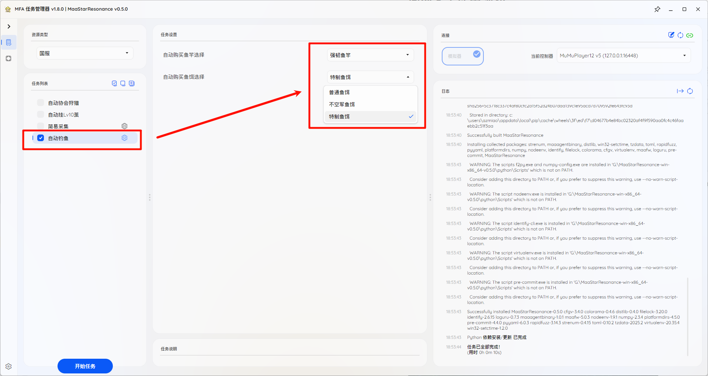

# 自动钓鱼使用须知

本模块为实现星痕共鸣自动无限钓鱼功能，可自动购买钓鱼配件

- [自动钓鱼使用须知](#自动钓鱼使用须知)
  - [特别鸣谢](#特别鸣谢)
  - [程序配置界面](#程序配置界面)
  - [开始钓鱼任务](#开始钓鱼任务)
  - [结束钓鱼任务](#结束钓鱼任务)

---

## 特别鸣谢

本程序使用的部分图片资源和部分逻辑来自[Particle_G](https://github.com/ParticleG)开发的[maa-star-resonance](https://github.com/26F-Studio/maa-star-resonance)，非常感谢！

## 程序配置界面

如图，点击`自动钓鱼`选项并勾选，随后可以设置需要自动购买的鱼竿和鱼饵，仅会在对应配件数量不足时自动购买补充

## 开始钓鱼任务

1. 请找个钓鱼点没满的位置，钓鱼人满了会自动退出程序，建议找个进入钓鱼再退出钓鱼后，还能有下图一中钓鱼按钮的位置，比较稳定
2. 可以在钓鱼点位置上，也可在钓鱼界面，如下面两张图均可
3. 不用担心进入省电模式，会自动处理，只要在钓鱼位置即可
4. 如遇服务器热重启导致的切线，本程序会自动退出
5. 确认好位置，到程序页面选择`自动购买鱼竿选择`和`自动购买鱼饵选择`，并`勾选`任务，然后即可点击`开始任务`

## 结束钓鱼任务

正常再程序界面`结束任务`即可，可观察程序右下角界面日志，如下图，打印了`[任务结束] 自动钓鱼已结束！`说明程序已结束，建议此时再操作设备以免出现意外

