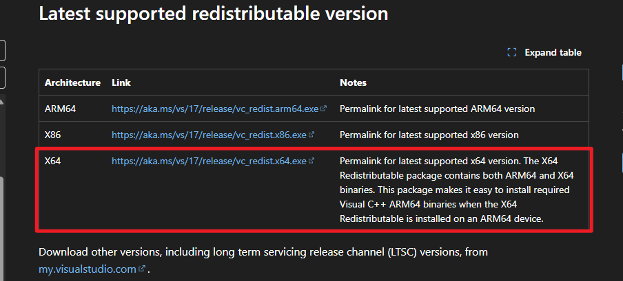
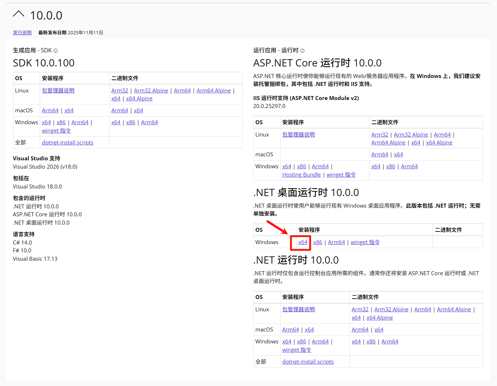

# 新手上路

## 1.环境配置

### 1.1系统环境配置

> 目前仅支持Windows系统

旧版文档

当前开发者只有 Windows(x64) 设备测试, 虽然 Release 中有自动编译的 macOS/Linux 等其他版本, 但是由于无人测试, 因此不保证可用

这里仅对 Windows(x86_64) 用户需要配置的系统环境进行说明, 一般来说下面这些环境用户电脑上都是存在的, 都是很常见的通用组件, 因此仅当您运行程序报错时需要查看本章节内容

---

#### 1.1.1.VCRedist

VCRedist(Visual C++ Redistributable)(Microsoft Visual C++ 可再发行组件包）是微软发布的一组**运行时库（runtime libraries）**，用于让电脑在没有安装 Visual Studio 的情况下，也能运行使用 Visual C++ 编译的程序。

很多现代游戏引擎（如 Unreal Engine、Unity、CryEngine）以及图形界面工具、视频处理软件等，内部都有 C++ 模块。
 这些模块依赖 Visual C++ 运行库来执行核心逻辑或调用底层 API（如 DirectX、OpenGL、Vulkan）。

> 在当前项目中, 由于使用了 [MFAAvalonia](https://github.com/SweetSmellFox/MFAAvalonia) 作为用户交互界面, 其使用 Visual Studio + C# 编写, 所以需要安装 VCRedist

VS2015、2017、2019、2022 版本共用同一组运行库（统一版）, 对应 vcredist2015–2022, 下载直链: [vc_redist.x64.exe](https://aka.ms/vs/17/release/vc_redist.x64.exe)

> 官方下载页面: [Latest supported Visual C++ Redistributable downloads | Microsoft Learn](https://learn.microsoft.com/en-us/cpp/windows/latest-supported-vc-redist?view=msvc-170)
>
> 
>
> 
>
> 一般而言现在还能流畅运行星痕共鸣的 Windows PC 一般都是 x64 不太可能是 x86, 因此当你不知道自己该下哪个的时候一般就是要下载这个 x64 的版本

---

#### 1.1.2..NET 10

**.NET 10 是微软的 .NET 平台的一个主要版本**，它提供了**C# 程序（以及 F#、VB.NET）运行所需的环境和基础库**。就像 C++ 需要 VCRedist 一样，C# 应用需要 .NET 运行时（Runtime）才能运行。

所有使用 MFAAvalonia 的用户都需要自行下载并安装适用于您系统的 .NET 10 。

注意：从MFAA v1.8.1开始才由需要使用.NET 10.0 Desktop Runtime

Windows x64 .NET 10.0 Desktop Runtime 下载直链: [windowsdesktop-runtime-10.0.0-win-x64.exe](https://builds.dotnet.microsoft.com/dotnet/WindowsDesktop/10.0.0/windowsdesktop-runtime-10.0.0-win-x64.exe)

> 微软官方 .NET 10 下载页面：
>  👉 [官网链接](https://dotnet.microsoft.com/download/dotnet/10.0)
>
> 

---

#### 1.1.3.Python

对于 Windows x64 用户而言, 本项目使用嵌入式 Python 包, Python 环境已包含在项目压缩包中, 无需单独配置

---

对于其他系统用户而言可能需要单独配置环境

---

解压从Release中下载的`MaaStarResonance-win-x86_64.zip`或`MaaStarResonance-win-aarch64.zip`，找到文件夹里的`DependencySetup_依赖库安装_win.bat`，双击运行即可自动检测环境并安装缺失的依赖

### 1.2.模拟器环境配置

当前开发者仅测试了 MuMu 模拟器, 这里仅对 MuMu 模拟器的一些配置进行说明

> 如果你有在使用 Maa / Maa1999(M9A) 等 Maa 系列的工具的话那这里一般是不需要改动的

模拟器分辨率应为`横屏` `16:9` 比例，推荐（以及最低）分辨率为 `1280x720`，不符合要求造成的运行报错将不会被解决。>

> ⚠️注意: 修改分辨率后模拟器主页应该是横屏（平板版），不要选成竖屏（手机版）了！
>
> ---
>
> 对于 MuMu 而言可以如下设置:
> 
>
> 在 `设备设置->显示` 页面设置分辨率, 一般有如下两种情况:
>
> - 如果你的 `平板` 设置中有 `1280 x 720(DPI 240)` 的话直接选择此项即可
>
>   
>
> - 如果你的 `平板` 设置中没有 `1280 x 720(DPI 240)` 的话, 请参考如下配置编写自定义配置:
>
>   

---

### 1.3.星痕共鸣配置

建议使用如下配置:

> 其他图像质量的场景未进行测试覆盖, 不保证可用, 也不一定不能用

---

## 2.开始使用

解压压缩包后, 运行其中的 `MFAAvalonia.exe`

> 也可以为这个 exe 创建快捷方式再重命名, 例如:
>
> 

启动后, MAAStarResonance 会尝试根据下图红框所框选的部分链接模拟器

- 如果目前只开了一个模拟器的话此时应该是可以正常连上的

- 如果目前开了多个模拟器的话则需要在如下模拟器下拉列表中选择目标模拟器:

  

  > 有时可能会出现列表中只有一个模拟器但是实际开了多个模拟器的情况, 如下:
  >
  > 
  >
  > 此时只需要先将光标切换到 `桌面应用`:
  >
  > 
  >
  > 加载出出面应用的信息然后再切回模拟器加载模拟器的信息即可:
  >
  > 

由于列表中我们需要根据模拟器的 adb 端口号来选择对应的模拟器, 所以我们需要确认我们当前目标账号所在的模拟器的 adb 端口号是多少

以 Mumu 为例, 可以在 `设备诊断` 中查看当前模拟器端口号, 如下图:

---

连接上模拟器后会进入启动python agent 以及安装/更新依赖的过程, 这个过程根据电脑性能情况耗时有所区别, 不需要额外操作, 只需等待即可:

> PS: 这个操作不会影响当前电脑的全局环境, 所有依赖安装修改均在当前 MAAStarResonance 目录下进行

可以在左侧工具栏的切换到 `截图` 页面, 进行模拟器截图以确认是否为目标模拟器/账号

---

然后切换到主页, 勾选并配置对应任务然后点击 `开始任务` 即可:

---
