# 新手上路

## 1.环境配置

### 1.1系统应用环境和依赖安装

> 目前仅支持 **Windows系统** + **MuMu模拟器** 环境启动星痕共鸣，其他模拟器要么星痕共鸣闪退，要么不支持`Touch Down`事件，我们也没办法

---

解压从Release中下载的`MaaStarResonance-win-x86_64.zip`或`MaaStarResonance-win-aarch64.zip`，找到文件夹里的`DependencySetup_依赖库安装_win.bat`，双击运行即可**自动检测环境并安装缺失的依赖**

### 1.2.显卡驱动调节

务必让你的MuMu模拟器使用独显渲染

> 如果你是`AMD的CPU`和`AMD的显卡`且`MuMu模拟器`跑`星痕共鸣`的帧率特别低，可以尝试如下设置调节，调完记得 **重启电脑**
>
> ---
>
> 1. 控制面板\系统和安全\电源选项，务必使用 **平衡** 模式，Win11下安装AMD的`Chipset芯片组`后，对平衡模式有特调逻辑
> 2. 显卡控制面板可参考如下配置：
>
> - 性能-调整：使用默认配置文件
> - 游戏-显卡：
>   - Radeon Anti-Lag: 启用
>   - 图片锐化（Image Sharpening）：启用
>   - 清晰度：80%
>   - 各向异性过滤：启用
>   - 各向异性过滤级别：8x
>   - 纹理过滤质量：高/标准均可
>   - 表面格式优化：启用
>   - 镶嵌模式：覆盖应用程序设置
>   - 最大镶嵌级别：关

---

### 1.3.模拟器环境配置

当前开发者仅测试了 MuMu 模拟器, 这里仅对 MuMu 模拟器的一些配置进行说明

> 如果你有在使用 Maa / Maa1999(M9A) 等 Maa 系列的工具的话那这里一般是不需要改动的

模拟器分辨率应为`横屏` `16:9` 比例，推荐（以及最低）分辨率为 `1280x720`，不符合要求造成的运行报错将不会被解决。>

> ⚠️注意: 修改分辨率后模拟器主页应该是横屏（平板版），不要选成竖屏（手机版）了！
>
> ---
>
> 对于 MuMu 而言可以如下设置:
> 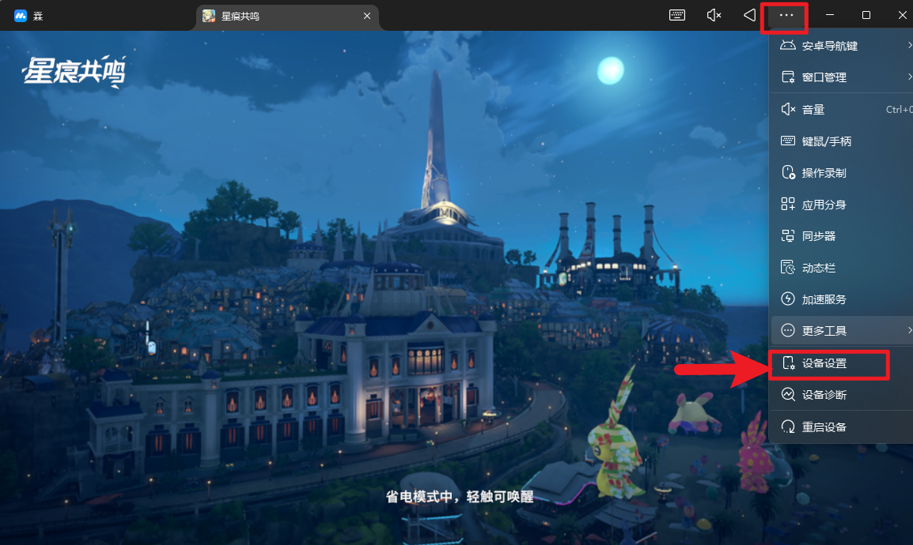
>
> 1. 设置您的设备CPU核数和内存，由于这破游戏的优化，建议设置`4核`和`6G内存`起步，也可调更高但几乎没影响，设备帧数上限不需要调节，因为实际不生效，设备型号也不要调，默认即可
> 2. 在 `设备设置->显示` 页面设置分辨率, 一般有如下两种情况:
>
> - 如果你的 `平板` 设置中有 `1280 x 720(DPI 240)` 的话直接选择此项即可
>
>   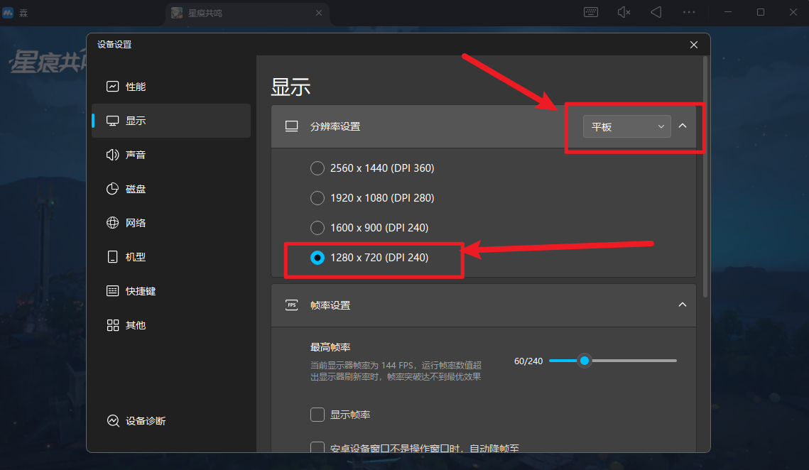
>
> - 如果你的 `平板` 设置中没有 `1280 x 720(DPI 240)` 的话, 请参考如下配置编写自定义配置:
>
>   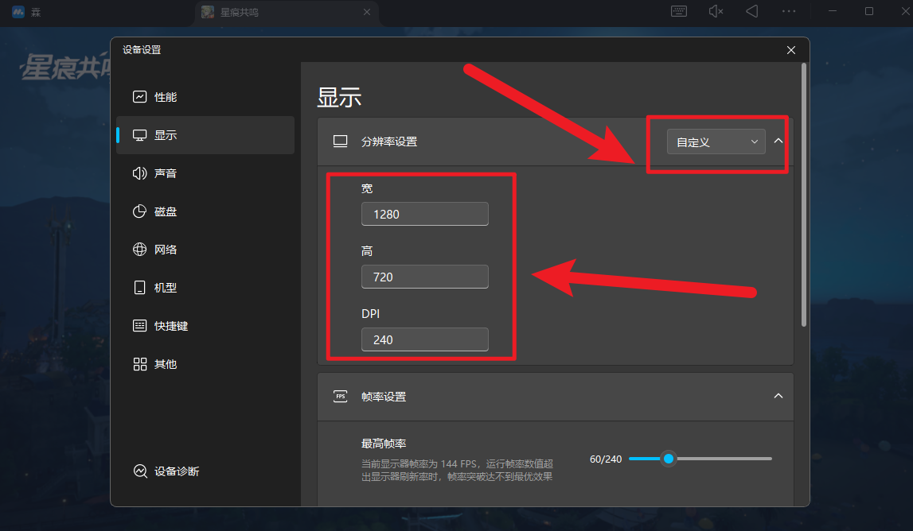

---

### 1.4.星痕共鸣配置

建议使用如下配置:

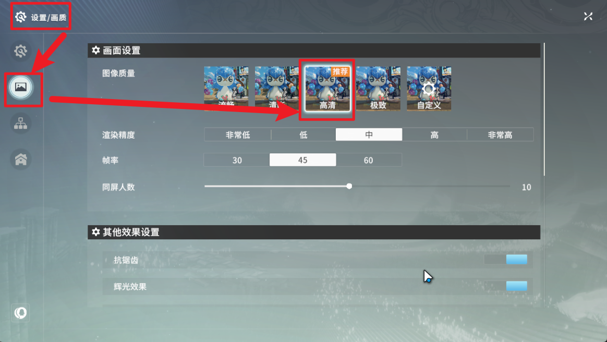

> 其他图像质量的场景未进行测试覆盖, 不保证可用, 也不一定不能用

---

## 2.开始使用

解压压缩包后, 运行其中的 `MFAAvalonia.exe`

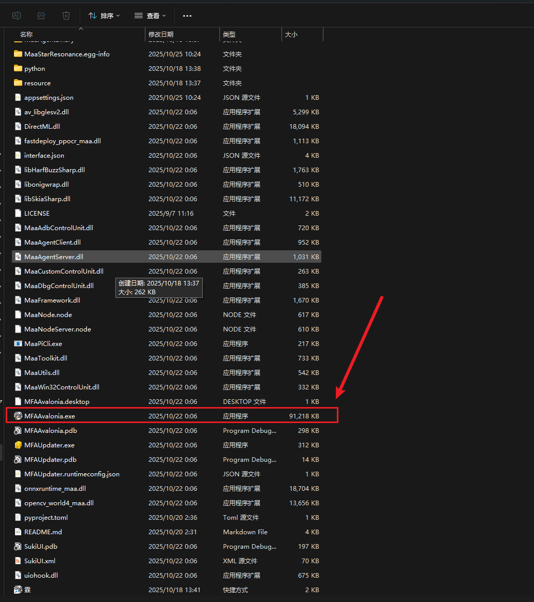

> 也可以为这个 exe 创建快捷方式再重命名, 例如:
>
> 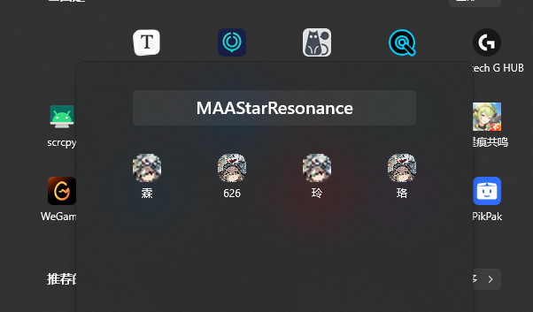

启动后, MAAStarResonance 会尝试根据下图红框所框选的部分链接模拟器

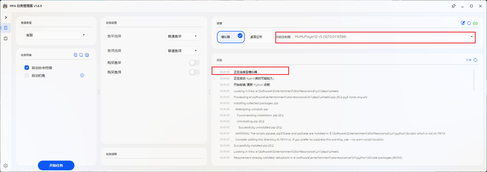

- 如果目前只开了一个模拟器的话此时应该是可以正常连上的

- 如果目前开了多个模拟器的话则需要在如下模拟器下拉列表中选择目标模拟器:

  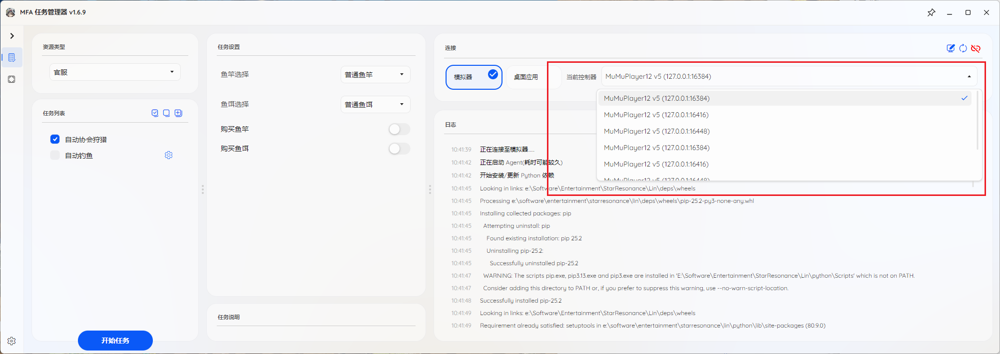

  > 有时可能会出现列表中只有一个模拟器但是实际开了多个模拟器的情况, 如下:
  >
  > 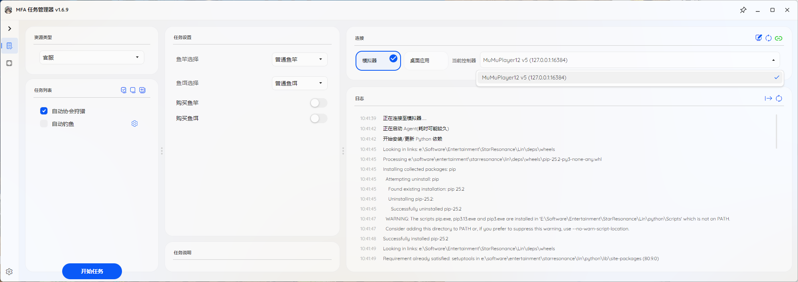
  >
  > 此时只需要先将光标切换到 `桌面应用`:
  >
  > 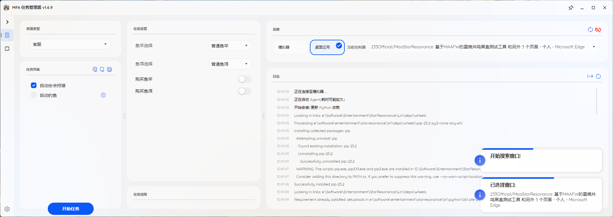
  >
  > 加载出出面应用的信息然后再切回模拟器加载模拟器的信息即可:
  >
  > 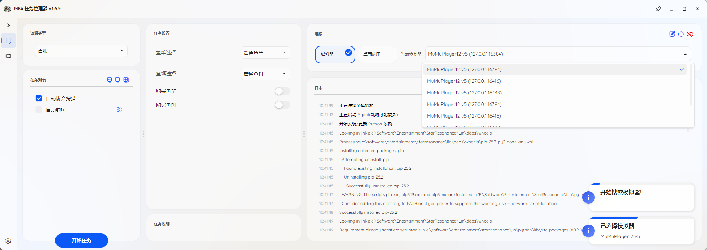

由于列表中我们需要根据模拟器的 adb 端口号来选择对应的模拟器, 所以我们需要确认我们当前目标账号所在的模拟器的 adb 端口号是多少

以 Mumu 为例, 可以在 `设备诊断` 中查看当前模拟器端口号, 如下图:

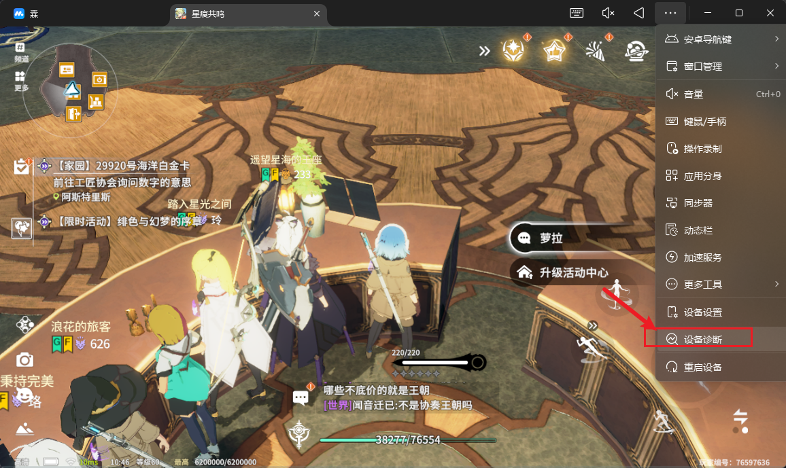

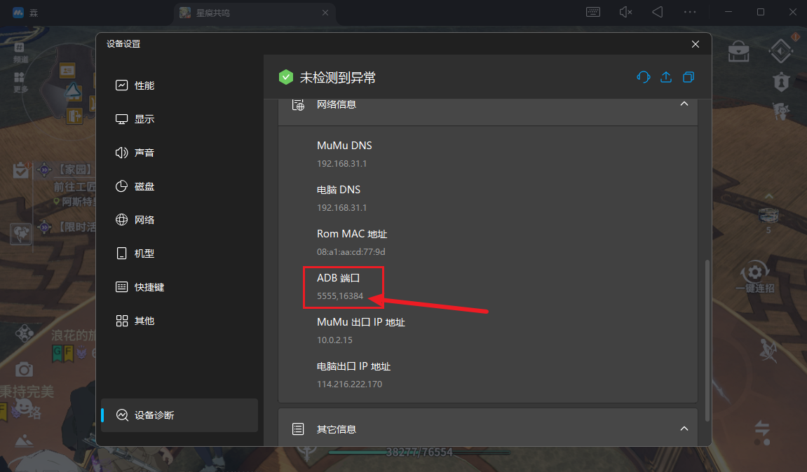

---

连接上模拟器后会进入启动python agent 以及安装/更新依赖的过程, 这个过程根据电脑性能情况耗时有所区别, 不需要额外操作, 只需等待即可:

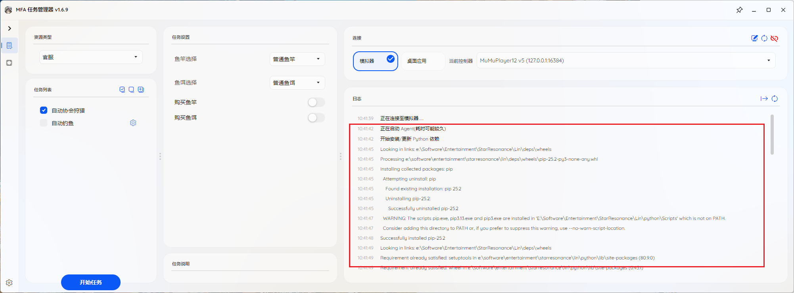

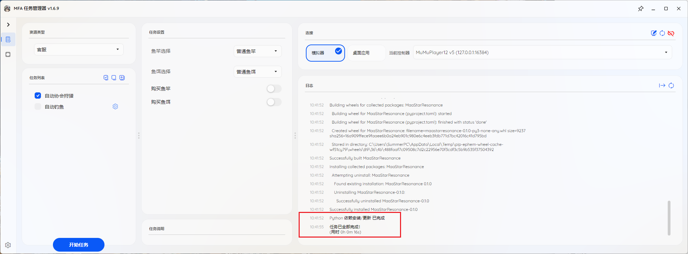

> PS: 这个操作不会影响当前电脑的全局环境, 所有依赖安装修改均在当前 MAAStarResonance 目录下进行

可以在左侧工具栏的切换到 `截图` 页面, 进行模拟器截图以确认是否为目标模拟器/账号

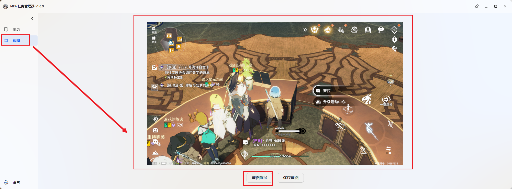

---

然后切换到主页, 勾选并配置对应任务然后点击 `开始任务` 即可:

---

## 3.使用技巧

- 您可以在左边任务列表看到预置的任务，可以勾选其中的多个执行，会自动按照顺序完成
- 当然您也可以复制任务，例如每天两次`不稳定空间`，就可以复制一份自动完成两次
- 您也可以尝试组合，比如先每日先`钓鱼XX条`，然后去打两次`不稳定空间`，然后领取每日活跃，这样简单的日常就清完了，后续会优化日常3+2的完成方式~
